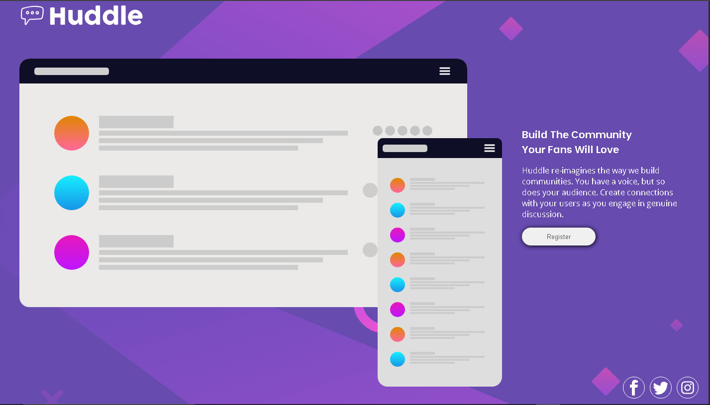
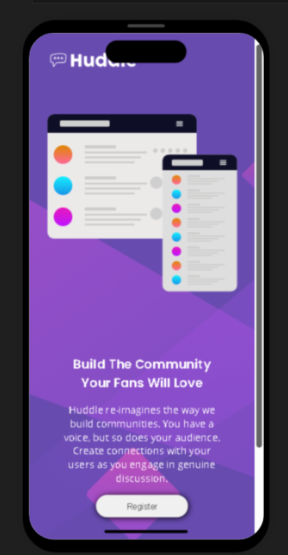

# Frontend Mentor - Huddle landing page with single introductory section solution

This is a solution to the [Huddle landing page with single introductory section challenge on Frontend Mentor](https://www.frontendmentor.io/challenges/huddle-landing-page-with-a-single-introductory-section-B_2Wvxgi0). Frontend Mentor challenges help you improve your coding skills by building realistic projects. 

## Table of contents

- [Overview](#overview)
  - [The challenge](#the-challenge)
  - [Screenshot](#screenshot)
  - [Links](#links)
  - [Built with](#built-with)
  - [Initial Approach](#initial-approach)
  - [Challenged Faced](#challenges-faced)
  - [Solutions Implemented](#solutions-implemented)
  - [What I learned](#what-i-learned)
  - [Continued development](#continued-development)
  - [Useful resources](#useful-resources)
- [Author](#author)
- [Acknowledgments](#acknowledgments)

## Overview

This repository contains my solution to the Frontend Mentor "Huddle landing page with a single introductory section" challenge. The project reproduces the challenge design using HTML and CSS, focuses on responsive layout and hover states, and demonstrates a desktop-first approach adapted with media queries for smaller screens. The live demo shows the rendered UI; the repo contains the source files and notes about my process.

### The challenge

Users should be able to:

- View the optimal layout for the page depending on their device's screen size
- See hover states for all interactive elements on the page

### Screenshot

 



### Links

- Solution URL: [https://github.com/Godson142/frontend-mentor-challenges](https://your-solution-url.com)
- Live Site URL: [https://godson142.github.io/frontend-mentor-challenges/](https://your-live-site-url.com)

### Built with

- HTML5
- CSS3 (Flexbox, Media Queries)

### Initial Approach
I began the project by designing the layout for larger screens first, focusing on desktop views. This allowed me to establish a clear structure and visual hierarchy before adapting the design for smaller screens.

### Challenges Faced
- Adapting the desktop layout to be responsive for mobile devices proved challenging, especially with maintaining usability and aesthetics.
- Ensuring that all interactive elements were accessible and visually appealing on smaller screens required significant adjustments.

### Solutions Implemented
- After completing the desktop version, I used media queries to adjust styles for mobile devices. This included changing flex directions, resizing elements, and modifying padding/margins to fit smaller screens.
- I tested the layout on various devices to ensure a consistent experience across different screen sizes.

### What I Learned
- I learned the importance of planning for responsiveness even when starting with a desktop-first approach. 
- I gained experience in using media queries effectively to create a fluid layout that adapts to different devices.

### Code Example
```css
/* Example of a media query for mobile responsiveness */
@media (max-width: 768px) {
  .main-div {
    display: flex;
    flex-direction: column;
    align-items: center;
    justify-content: center;
  }
}
```

### Continued development

I would like to continue focusing on Flexbox and also Grid. I have basic skills to handle that, but I want to know more about them and how I would use them without flaws. 

Also, I would like focus on Responsive Design(Mobile Design). I barely scratch the surface with this current challenge. Although, I managed to make it look like the challenge design somehow, but I believe there is more to do, to add and to improve on. 


## Author

- Website - [Godson](https://godson142.github.io/personal-project/)
- Frontend Mentor - [Godson142](https://www.frontendmentor.io/profile/Godson142)
- Twitter - [Godson](https://www.twitter.com/Hokage12584241)


## Acknowledgments

Thanks to Frontend Mentor for the challenge and the design specifications 🙏🙏.
And I thank God for giving the strength and willpower to complete this challenge even when I was injured severely. To Him be all glory.🤲🤲


